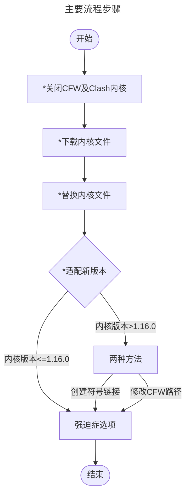

## 简介

由于Clash及其周边生态项目于2023年11月上旬删库跑路，因此其不再能支持新的特性以及协议。由于本人已经习惯使用Clash for Windows（CFW）的界面和操作逻辑，因此寻求将其内置的Premium内核修改为[Meta内核](https://github.com/MetaCubeX/mihomo/tree/Meta)（Mihomo内核）的方法。本文适用于不想抛弃CFW的UI又有新的支持协议需求及特性需求的使用者，若嫌麻烦请使用[clash-verge-rev](https://github.com/clash-verge-rev/clash-verge-rev)等其他客户端。本文中的步骤参考了多个博客并进行了实际操作，在作者的电脑上能够正常使用。

> 此修改具有一定的复杂性，若担心客户端因此出现问题请备份旧文件。
{: .prompt-danger}

## 大致流程

图中带*的操作为必做。



### 关闭CFW及Clash内核

关闭CFW进程及Clash内核的进程，如图所示
{: .light .w-75 .rounded-90 w='994' h='705'}
{: .dark .w-75 .rounded-90 w='994' h='705'}

### 下载内核

下载适合自己操作系统及CPU架构的[mihomo内核](https://github.com/MetaCubeX/mihomo/releases)（作者使用的是1.18.6版本 `mihomo-windows-amd64-compatible-go120-v1.18.6.zip`

### 替换内核

打开CFW安装目录下的 `\resources\static\files\win\x64`{: .filepath} 文件夹，将以上下载到的文件改名为 `clash-win64.exe` 并替换对应文件。

> 再次提示若担心出现问题请备份文件，下面将不再提醒。
{: .prompt-danger}

### 适配新内核

#### 1. 使用了较旧版本
若使用的内核版本为1.16.0及以下的版本则不必进行适配。参考[^1]中提到带compatible字样的也不必适配，但本人不适配无法连接内核，mihomo的wiki也提到compatible字样仅表示为了兼容特定的操作系统或架构而编译，因此本人认为1.16.0以上的版本即使带compatible字样也需要进行适配。
#### 2. 创建符号链接[^2]

打开cmd并执行以下命令。(可能需要管理员权限)
  
```bat
mklink /d "%USERPROFILE%\.config\mihomo" "%USERPROFILE%\.config\clash"
```

#### 3. 修改CFW路径

> 此方法较为复杂，可以使用我修改好的文件[英文界面版本](/assets/20240912/app-english.asar)和[中文界面版本](/assets/20240912/app-chinese.asar)来替换 `\resources\app.asar`{: .filepath} 文件。中文界面版本基于[Clash-for-Windows_Chinese](https://github.com/Z-Siqi/Clash-for-Windows_Chinese)修改。
{: .prompt-danger .ml-0}

以下为具体的修改步骤。

打开CFW的安装目录下的 `resources` 文件夹，将 `app.asar` 解包。推荐使用[此工具](https://www.cnblogs.com/binghe021/p/17622220.html)[^3]。


解包后进入 `\dist\electron`{: .filepath} 目录，打开 `render.js`{: .filepath} 文件（运行内存较小的设备建议使用记事本打开，我使用VSCode也和参考博主一样卡死了。。。）。搜索 `/.config` ，将后面的 `clash` 改成 `mihomo` ，然后保存。

使用工具重新打包，改名为 `app.asar` ，替换原本的文件。

如果有之前的订阅数据建议进入 `%USERPROFILE%/.config/clash`{: .filepath} 文件夹把里面的 `profiles` 文件夹复制到 `%USERPROFILE%/.config/mihomo`{: .filepath} 里去。

## 测试。

打开CFW，在Clash内核的位置显示Unknown并可以正常使用，则修改成功。

## 强迫症选项。

### Clash内核Unknown修改
本人和参考博主[^1]同样看着Unknown难受，在此万分感谢博主提供的方法。我提供的asar文件中已经修改了强迫症选项中的内容。

同样解包 `app.asar` 后进入 `\dist\electron`{: .filepath} 目录下，打开 `render.js`{: .filepath} 文件，搜索 `n.premium` ，首先将后面的 `0!==o&&` 删除，然后找到后面的 `"Premium":""` ，改为 `"Premium":"Meta"` ，然后重新打包替换即可。

### 修复服务模式小地球灰色

需要回退service的版本，据评论区反馈，应该是由于较新版本的Service Mode安全性有提高，因此应使用 `v0.19.29` 及以下版本的 `clash-core-service.exe` ，此处提供一个[早期版本](/assets/20240912/service.zip)的exe文件。将下载到的文件替换目录 `\resources\static\files\win\x64\service`{: .pathfile} 里的文件

注意替换之后可能还是无法启动，可能是之前启动过较新版本的CFW。找到运行中的进程 `clash-core-service.exe` 打开程序位置进行替换（本人是在 `C:\Program Files\Clash for Windows Service`{: .filepath} 路径下）。替换完成后可能需要重新进入CFW安装Service Mode。

## 完成

以下是完成后的效果

{: .light .w-75 .rounded-10}
{: .dark .w-75 .rounded-10}

## 参考

[^1]: [将 Cfw 的内核修改为修改为 Meta 内核](https://www.nodeseek.com/post-135393-1)
[^2]: [修改 CFW 的内核为最新的mihomo内核](https://blog.leginn.top/archives/Cfw_Hhm.html)
[^3]: [ASAR解包打包工具软件AsarHelper发布](https://www.cnblogs.com/binghe021/p/17622220.html)